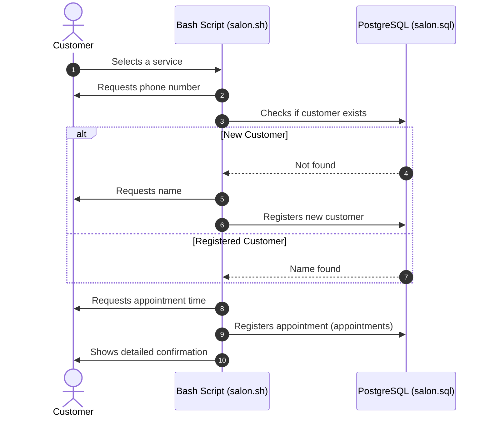

# ✂️ Salon Appointment Scheduler (PostgreSQL + Bash CLI)

*🇪🇸 [Leer en español](README.es.md)*

Interactive Command Line Interface (CLI) application written in Bash and connected to PostgreSQL for dynamic customer management and appointment scheduling in a beauty salon.

---

## ⚡ Application Flow



---

## ✨ Key Features
* **Interactive Console Interface:** Dynamic menus with error handling and invalid inputs through recursive functions in Bash.
* **Smart Registration Flow:** Verification of existing customers via phone number to avoid duplicate records.
* **Relational Persistence:** Table management for services (`services`), customers (`customers`), and appointments (`appointments`) with foreign keys.
* **Data Formatting:** Trimming of trailing whitespaces returned by psql to present clear messages to the user.

## 🛠️ Technologies Used
* Database: PostgreSQL
* Language: Bash / Shell Scripting (`psql` CLI)

## 🚀 Installation and Execution
### Prerequisites
Have PostgreSQL installed and configured in your local environment.
### Steps
1. **Clone the repository:**
```bash
  git clone https://github.com/Aki-new/salon-appointment-scheduler.git
  cd salon-appointment-scheduler
```
2. **Create and import the database schema:**
```bash
 psql -U postgres < salon.sql
```
3. **Grant execution permissions and start the application:**
```bash
 chmod +x salon.sh
 ./salon.sh
```

---

## 📜 Credits and Acknowledgments

* **Challenge / Dataset Origin:** This project is one of the challenges required to obtain the **Relational Database Certification** from [freeCodeCamp](https://www.freecodecamp.org/).
* **Implementation:** The Bash scripting logic (`salon.sh`) and the structuring of the PostgreSQL schema (`salon.sql`) were developed entirely as an individual solution to the presented problem.
